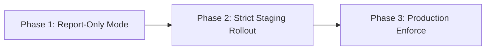

# Content Security Policy (CSP) Level 3 Best Practices Guide

Content Security Policy (CSP) is one of the most powerful client-side security mechanisms available in modern browsers. When designed properly, it completely prevents Cross-Site Scripting (XSS), data exfiltration, clickjacking, and malicious frame injection.

---

## 🚫 Why Traditional Allowlist CSP Fails

Earlier CSP specifications (CSP Level 1 & 2) relied heavily on domain allowlists:

```http
Content-Security-Policy: default-src 'self' https://cdnjs.cloudflare.com https://cdn.jsdelivr.net;
```

### The Problem:
1. **JSONP Endpoints**: An attacker finding any JSONP endpoint hosted on an allowlisted CDN (such as Google, Cloudflare, or Yahoo) can bypass the entire CSP by executing arbitrary callback scripts.
2. **AngularJS / Vue / React Bypasses**: Older client libraries hosted on CDNs allow client-side template injection bypasses.
3. **Maintenance Overhead**: Adding every third-party vendor leads to enormous, unmaintainable policies that grow increasingly insecure over time.

---

## 🛡️ The Solution: CSP Level 3 & `'strict-dynamic'`

Google's Web Security Research team pioneered the **Strict CSP** model:

```http
Content-Security-Policy:
  object-src 'none';
  script-src 'nonce-{RANDOM_BASE64}' 'strict-dynamic' https: 'unsafe-inline';
  base-uri 'self';
```

### How `'strict-dynamic'` Works:
1. **Cryptographic Nonce**: The browser executes only scripts that possess a matching `nonce="rAnd0m..."` attribute generated by the server for that single request.
2. **Dynamic Dependency Trust**: Scripts executed via a valid nonce are permitted to dynamically load child scripts (`document.createElement('script')`). This allows complex tools like Google Analytics, Google Tag Manager, Stripe, and YouTube players to function seamlessly without opening broad domain allowlists.
3. **Graceful Backward Compatibility**:
   - In CSP Level 3 browsers (all modern browsers), `'strict-dynamic'` automatically causes the browser to ignore domain allowlists and `'unsafe-inline'`.
   - In legacy browsers (CSP Level 2/1), the browser falls back to the allowlist or `'unsafe-inline'`.

---

## 📐 Directive-by-Directive Defense Checklist

### 1. `object-src 'none'`
- **Mandatory**. Completely disables legacy Flash, Java, and Silverlight plugin execution.

### 2. `base-uri 'self'` (or `'none'`)
- Prevents malicious `<base href="https://evil.com">` injections that hijack relative script and stylesheet imports.

### 3. `frame-ancestors 'none'` (or `'self'`)
- Modern, CSP-native replacement for `X-Frame-Options: DENY`. Forbids unauthorized embedding in `<iframe>`, `<frame>`, and `<applet>`.

### 4. `form-action 'self'`
- Restricts the target URLs to which `<form>` submissions can post sensitive credentials or user data.

### 5. `upgrade-insecure-requests`
- Instructs the browser to rewrite all insecure HTTP asset URLs to HTTPS before initiating network requests.

---

## 🔄 CSP Migration Strategy: 3 Phases



1. **Phase 1: Report-Only Mode**
   Deploy using the `Content-Security-Policy-Report-Only` header pointing to your logging endpoint:
   ```http
   Content-Security-Policy-Report-Only: default-src 'self'; script-src 'self' 'nonce-...' 'strict-dynamic'; report-uri https://api.yoursite.com/csp-report;
   ```
2. **Phase 2: Triage Violations**
   Analyze reports to identify legitimate third-party analytics, chat widgets, or inline styles needing nonces.
3. **Phase 3: Enforce Mode**
   Switch header to `Content-Security-Policy` and enforce strict blocking.
