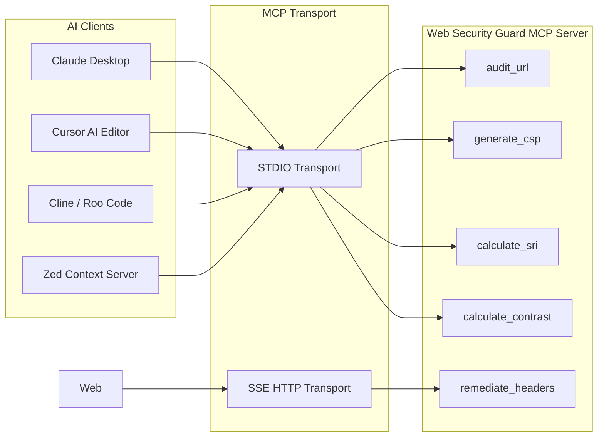

# Web Security Guard — Model Context Protocol (MCP) Integration Guide

The **Model Context Protocol (MCP)** is an open standard that allows Large Language Models (LLMs) and autonomous AI coding agents to securely access external tools, APIs, and execution environments.

`web-security-guard` includes a native, zero-dependency MCP server implementation that equips agents in **Claude Desktop**, **Cursor AI**, **Cline**, **Roo Code**, **Zed Editor**, and custom agent swarms with automated web security auditing, Level 3 CSP synthesis, and Subresource Integrity calculation.

---

## 🏗️ Architectural Overview



---

## 🛠️ MCP Tool Catalog & Signatures

### 1. `audit_url`
Conducts a comprehensive, multi-vector HTTP response header and cookie security audit against live targets.

```json
{
  "name": "audit_url",
  "description": "Performs deep multi-vector security header, cookie, and defense-in-depth audit for any public URL.",
  "parameters": {
    "type": "object",
    "properties": {
      "url": {
        "type": "string",
        "description": "Target HTTP or HTTPS URL to audit (e.g. https://example.com)"
      }
    },
    "required": ["url"]
  }
}
```

### 2. `generate_csp`
Synthesizes Level 3 Content Security Policies with nonce support and generates drop-in framework configurations.

```json
{
  "name": "generate_csp",
  "description": "Generates a CSP Level 3 policy string with 'strict-dynamic' and exports for Next.js, Nginx, Vercel, Netlify.",
  "parameters": {
    "type": "object",
    "properties": {
      "preset": {
        "type": "string",
        "enum": ["strict_nonce", "strict", "spa", "api"],
        "description": "Preconfigured architectural security template"
      },
      "nonce": {
        "type": "string",
        "description": "Optional cryptographic nonce placeholder"
      },
      "report_uri": {
        "type": "string",
        "description": "Optional violation reporting URL"
      }
    }
  }
}
```

### 3. `calculate_sri`
Calculates cryptographic digests for external JavaScript and CSS assets and produces standard HTML `<script>` / `<link>` tags.

```json
{
  "name": "calculate_sri",
  "description": "Calculates SHA-256, SHA-384, and SHA-512 Subresource Integrity hashes and formats HTML tags.",
  "parameters": {
    "type": "object",
    "properties": {
      "content": { "type": "string", "description": "Raw script or stylesheet source code" },
      "url": { "type": "string", "description": "Remote asset URL to fetch and hash" }
    }
  }
}
```

### 4. `calculate_contrast`
Validates foreground/background color combinations against WCAG 2.2 Level AA / AAA standards and simulates color vision deficiencies.

```json
{
  "name": "calculate_contrast",
  "description": "Calculates WCAG 2.2 color contrast ratio, AA/AAA compliance, and color blindness simulations.",
  "parameters": {
    "type": "object",
    "properties": {
      "fg": { "type": "string", "description": "Foreground color in hex format (e.g. #1a73e8)" },
      "bg": { "type": "string", "description": "Background color in hex format (e.g. #ffffff)" }
    },
    "required": ["fg", "bg"]
  }
}
```

### 5. `remediate_headers`
Generates drop-in server configuration files tailored to fix all missing security headers identified during an audit.

```json
{
  "name": "remediate_headers",
  "description": "Generates platform-specific server config files to fix identified security vulnerabilities.",
  "parameters": {
    "type": "object",
    "properties": {
      "target": {
        "type": "string",
        "enum": ["nextjs", "nginx", "vercel", "netlify", "apache", "cloudflare"],
        "description": "Deployment platform target"
      }
    },
    "required": ["target"]
  }
}
```

---

## ⚡ Client Configuration Walkthroughs

### Claude Desktop
Edit your Claude configuration file:
- **macOS**: `~/Library/Application Support/Claude/claude_desktop_config.json`
- **Windows**: `%APPDATA%\Claude\claude_desktop_config.json`
- **Linux**: `~/.config/Claude/claude_desktop_config.json`

```json
{
  "mcpServers": {
    "web-security-guard": {
      "command": "uvx",
      "args": ["web-security-guard", "mcp"]
    }
  }
}
```

### Cursor AI
Add to your project's `.cursor/mcp.json`:
```json
{
  "mcpServers": {
    "web-security-guard": {
      "command": "uvx",
      "args": ["web-security-guard", "mcp"]
    }
  }
}
```

---

## 💬 Sample AI Prompt Scenarios

- *"Audit https://staging.myapp.com and give me a step-by-step remediation plan to fix missing headers."*
- *"Generate a Next.js App Router middleware that produces a CSP nonce and protects against clickjacking."*
- *"Calculate the SRI hash for the latest Tailwind CSS CDN script and give me the secure HTML link tag."*
- *"Check if our button color #1a73e8 on #f8f9fa passes WCAG 2.2 AA standards for normal and large text."*
